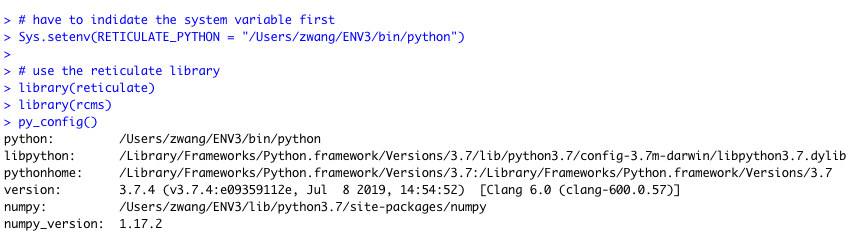
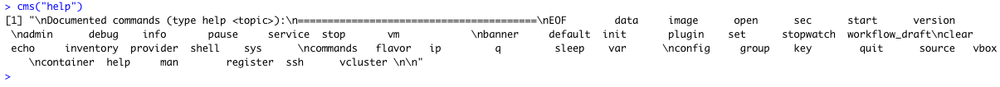
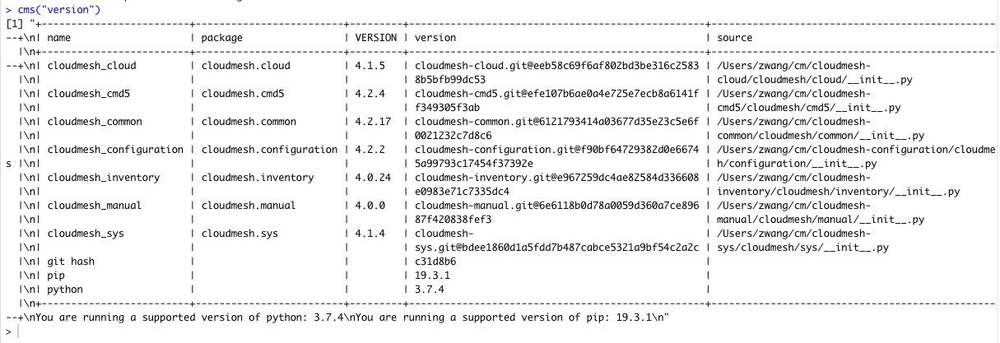

# Impletmention of Cloudmesh Compute Project in Rstudio

Zhi Wang, [fa19-516-165](https://github.com/cloudmesh-community/fa19-516-165), School of Public Health, Indiana University Bloomington

## Abstract

The purpose of this project is to implement Cloudmesh service in RStudio/R. As a popular programming language, R/RStudio
(IDE) are well-known in data science community. One major limitation of R is that it stores its data to local memory. As
such, there is a need to integrate the cloud services into RStudio. The purpose of this project is to build a R package
to use Cloudmesh-cms function in R and RStudio. 

## Introduction

The purpose of this project is to implement related features to simplify compute
interface of Cloudmesh in RStuido and to build a R package to use Cloudmesh-cms function in R and RStudio. . 

Cloudmesh is an easy way to manage different cloud services including Openstack, Azure, AWS, and Google Cloud Platform 
(under developing). Cloudmesh is able to start virtual machine in command line as well as a command shell. Using 
Cloudmesh is able to simplify the cloud implementation process.

R programming is a very popular language in data science field. RStudio is a development environment for R (similar 
Python v.s. Pycharm). R has strong presence in data analytics field. But it does not come without limitations. 
First, R programming language is based on S language (over 50 years old). But the old technologies have been updated 
since R becomes more and more popular. Another limitation is that R stores all objects in physical memory. As such, 
computing power highly depends on the local RAM capacity. 

Thus, there is a need to integrate R with cloud services as R become popular in data science field. Even though most 
cloud services provide R programming in their service, Cloudmesh provides a channel to interact with different cloud 
services. 

## Process 

Overall there are four steps to implement this project:

1. Install necessary R package - Reticulate

Reticulate is a R programming package to interface with Python. It can choose either call the Python script in the same 
folder or write Python Code in the a Markdown session. 

```r
# install.packages("reticulate")

# load  reticulate in R
library(reticulate)
```

2. Indicate Python Environment

In this step, we need to indicate which Python environment should use. For example, in our class, we created a virtual
environment to run our project. 

```` r
# activate the Python with existing Cloudmesh installation

Sys.setenv(RETICULATE_PYTHON = "/Users/zwang/ENV3/bin/python")
````

3. Create the function to implement the Cloudmesh cms Function

```r
cms <-function (command){
  library(reticulate)
  cloudmesh <- import("cloudmesh")
  cloudmesh$cloud$Shell$cms(command)
}
```

4. Create the R Package for Distribution

4.1 One of the easiest way to create a R package through RStutido. The required library is use the package called 'devtools'.

```r
install.packages('devtools')
```

4.2 create a R Package Projects through the file manue

4.3 Indicate the function R file

4.4 Build the package and restart RStudido 

4.5 Revise the R Document file in man folder

4.6 Build the .tgz file for distribution

## Results

This project has successfully implemented Cloudmesh cms function within RStudio. The test results are included in the 
Screenshots session. 

## Screenshots

1. Set the Python Environment in R 

2. load the reticulate and rcms package



3. test the cms help command in R



4. test the cms version command in R 



## Project Checklist

### Limitations 

This implementation has limitations. First, the project is only a small step of implementation Cloudmesh in R. It focuses
only on one command - cms function Second, 
the Python script -- Cloudmesh with OpenStack (based on previous work).

## References

* [Cloudmesh Development Projects- Cloudmesh Compute](https://cloudmesh.github.io/cloudmesh-manual/projects/project-compute.html)
* [Using the Cloud Client Libraries for Python](https://cloud.google.com/compute/docs/tutorials/python-guide)
* [Github Cloudmesh Compute](https://github.com/cloudmesh/cloudmesh-cloud/tree/master/cloudmesh/compute)
* [oh-my-zhs](https://ohmyz.sh)
* [Scripting OS X](https://scriptingosx.com/)
* [Google API core library](http://googleapis.github.io/google-api-python-client/docs/epy/index.html)
* [Instructions for Creating Your Own R Package](http://web.mit.edu/insong/www/pdf/rpackage_instructions.pdf)

## Appendix 

### Progress

#### Week October 14 

##### Solved Cloudmesh setting issues on macOS Catalina 

##### Learned command line, bash file, and zsh in macOS Catalina

Since Catalina uses zsh as its default shell, installation process is 
a little different compared with previous bash file. Thanks to Dr. Laszewski, I was able to 
install Cloudmesh smoothly. Besides this, I also studied a 
little further on shell on .bash_profile and .zprofile. 

###### Why switch from .bash_profile to .zprofile

I found that it is even though there are bash v4 and v5 available, Apple 
does not update to newer versions because of the licenses (bash v3.2 with 
GPL v2. and v4/v5 with GPL v3.). 

###### Solution to stick to bash without warning message

Bash file is not gone but will not last indefinitely either. For Catalina
users, if you want to stick to bash, you can add follow environment variable 
to your .bash_profile or .bashrc. 

 ~~~~
 export BASH_SILENCE_DEPRECATION_WARNING=1
 ~~~~

For more information about zsh configuration, please visit [oh-my-zsh](https://ohmyz.sh)
for more information. 

###### Complete Steps to reinstall/create Python virtual environment in macOS Catalina

- Why we need Python virtual environments?

For different python projects, developers need different python development 
environment to deploy codes. Virtual environments are needed to avoid destroy 

- Steps to to create new environment for new projects by command lines. 

    1. Create a new python 3 virtual environment and name it
    
        ~~~~
        python3 -m venv ~/environment_name
        ~~~~
        
    2.  Activate your new virtual environment. This step is important since
    you need to activate your new python environment.  
    
        ~~~~
        source ~/environment_name/bin/activate
        ~~~~
        
    3. Even though you can use pycharm to install a package, you still 
    need to have a package manager to help yo manage your packages. Starting 
    this point, you are able to install the packages you want. 
    
        ~~~~
        pip install pip -U
        ~~~~
        
     4. To manage your environment easier, you can modify your zprofile 
    and switch your environment easily. 
     
        ~~~~
        alias d="source ~/environment_1/bin/activate "
        alias env3="source ~/environment_2/bin/activate"
        ~~~~
        
        Next time, you can just type aliases to activate your environments.
    
 ##### Week October 21 
 
 Identified related Google Cloud Libraries that are useful to this project, including
 
  1.  Key Management Service API
  
  2. Compute Engine Client API
  
##### Week November 4

Reviewed the Google Cloud Platform Python client library. In this week, I reviewed the documentations of Cloud Client 
Libraries for Python. 

##### Week November 11

Started to code Provider.py file for GCP.

##### Week November 26

After discussion with Dr. Laszewski, I decided to switch the project from implementing Google Cloud Platform to 
implementing Cloudmesh with OpenStack within RStudio. 

#### Week of December 2

- Listed all required steps to implement the project
- Re-defined the scope of this project with instructor
- Write the function of rcms and create the rcms R package